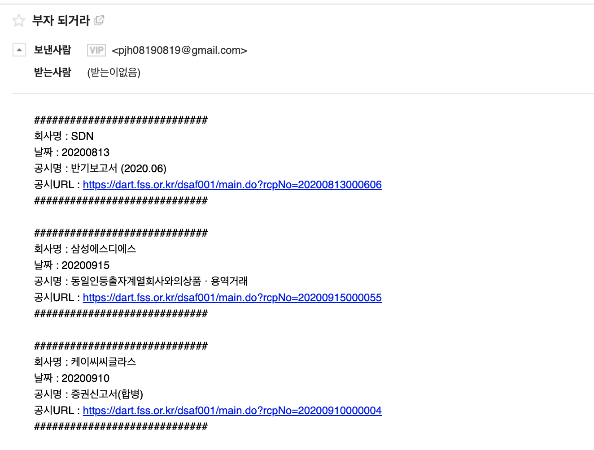

# forYourStock
- 주식에 중독된 친구 경철이를 위해 공시를 보내주는 것이 목적
- Dart에 등록된 상장 회사들의 최근 공시를 가져와서 포멧에 맞게 가공 후 보냄

## 1. 개발 환경
- OS : CentOS7
- 개발언어 : golang
- 세팅 파일 : .config
```
 export APIKEY=[API 인증키]
 export GMAIL_ID=[본인 GMAIL ID]
 export GAMIL_PASS=[본인 GMAIL PASS]
 expoer TARGET_ID=[대상 이메일]
```

## 2. 플래그
- 회사 리스트 다운 플래그 : [예정]
- 회사 리스트 실행 플래그 : [예정]


## 3. 결과
디자인이 좀 그렇지만 공시는 일단 잘 전달된거 같음



